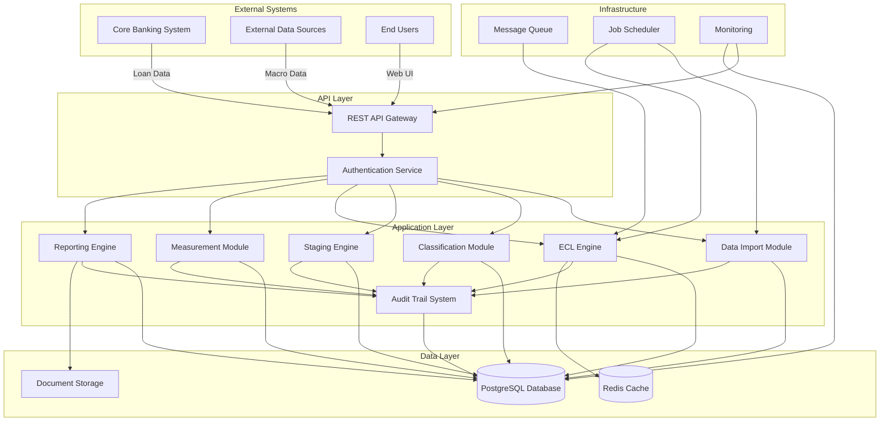
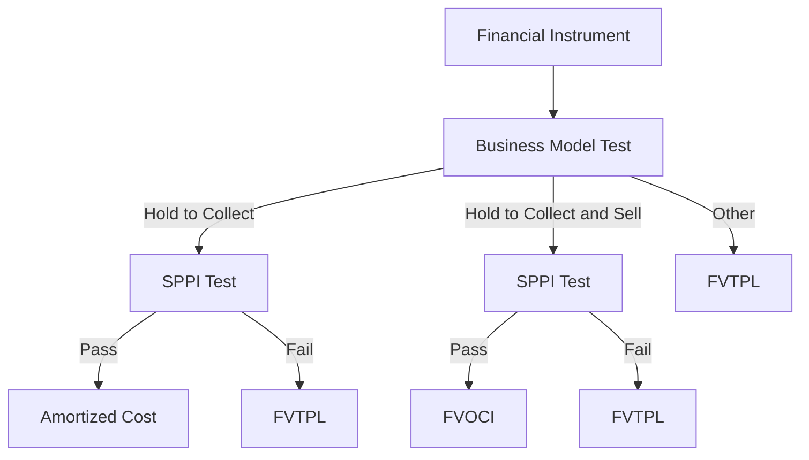
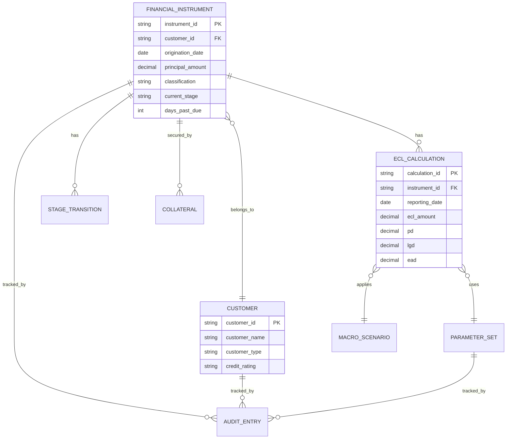
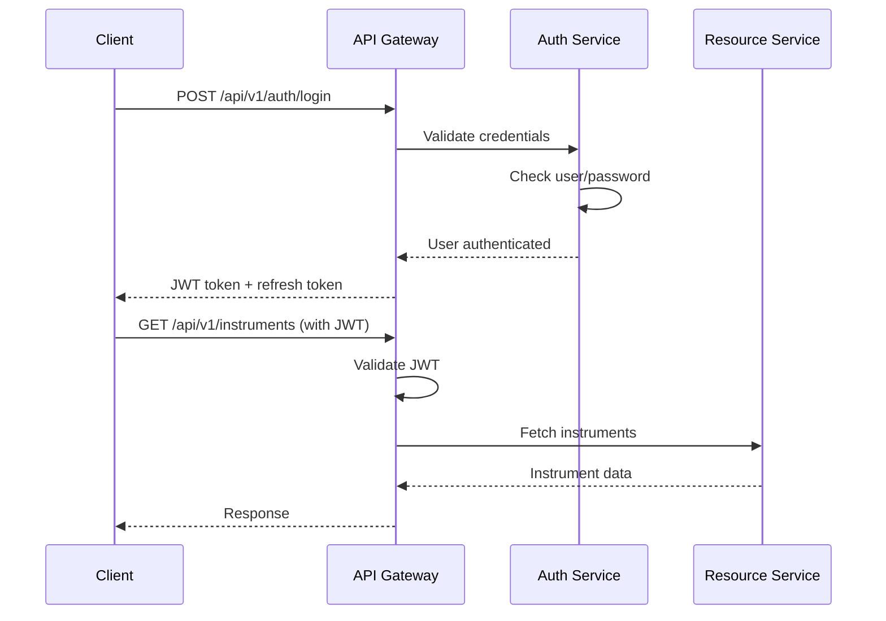
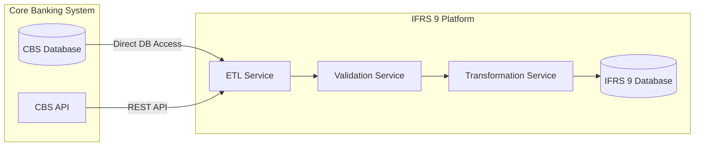
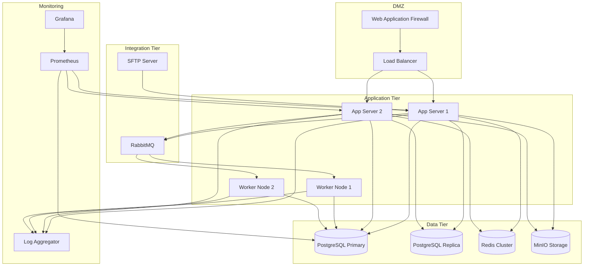
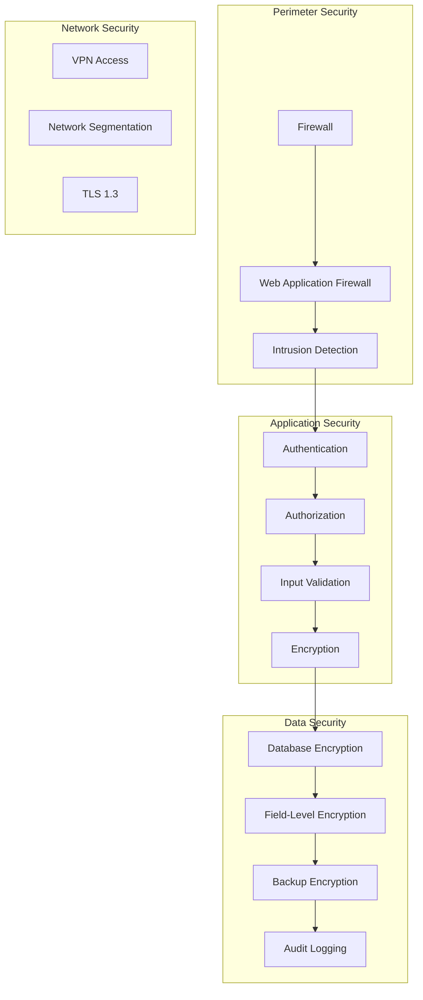

# IFRS 9 Automation Platform - Technical Design Document

## Overview

### Purpose

This document provides the technical design for an IFRS 9 automation platform for commercial banks in Uganda. The platform automates financial instrument classification, three-stage impairment modeling, expected credit loss (ECL) calculations, regulatory reporting, and comprehensive audit trails to ensure compliance with IFRS 9 accounting standards and Bank of Uganda requirements.

### Scope

The platform encompasses:
- Financial instrument classification and measurement
- Three-stage impairment model implementation (Stage 1, 2, 3)
- ECL calculation engine with PD, LGD, and EAD parameters
- Significant Increase in Credit Risk (SICR) detection
- Macroeconomic scenario integration
- Data import from core banking systems
- Regulatory and management reporting
- Comprehensive audit trail system
- User access control and security
- API integration capabilities

### Design Principles

1. **Accuracy and Auditability**: All calculations must be traceable with complete audit trails
2. **Regulatory Compliance**: Strict adherence to IFRS 9 standards and Bank of Uganda requirements
3. **Scalability**: Support for portfolios up to 100,000+ financial instruments
4. **Data Integrity**: Robust validation and reconciliation mechanisms
5. **Security**: Role-based access control and data encryption
6. **Maintainability**: Modular architecture with clear separation of concerns
7. **Performance**: Meet monthly reporting deadlines with efficient processing
8. **Flexibility**: Configurable parameters and rules to adapt to bank-specific policies

## Architecture

### System Architecture Pattern


The platform follows a **modular monolithic architecture** with clear domain boundaries. This approach is chosen over microservices for the following reasons:

1. **Transactional Consistency**: IFRS 9 calculations require ACID transactions across classification, staging, and ECL calculations
2. **Deployment Simplicity**: Ugandan banks typically have limited DevOps resources
3. **Performance**: In-process communication is faster for calculation-intensive operations
4. **Data Consistency**: Single database ensures referential integrity for audit trails
5. **Cost Efficiency**: Lower infrastructure and operational costs

The architecture can evolve to microservices if scaling requirements demand it, with clear module boundaries facilitating future decomposition.

### High-Level Architecture Diagram



### Technology Stack

**Backend Framework**: Python 3.11+ with FastAPI
- Rationale: Excellent for financial calculations, strong data science ecosystem (NumPy, Pandas), FastAPI provides high performance and automatic API documentation

**Database**: PostgreSQL 15+
- Rationale: ACID compliance, excellent support for financial data types (NUMERIC for precision), robust transaction handling, JSON support for flexible audit logs

**Caching**: Redis 7+
- Rationale: Fast parameter lookups, session management, calculation result caching

**Message Queue**: RabbitMQ
- Rationale: Reliable message delivery for asynchronous ECL calculations, supports priority queues for urgent recalculations

**Job Scheduler**: APScheduler
- Rationale: Python-native, supports cron-like scheduling for automated imports and calculations

**API Documentation**: OpenAPI 3.0 (via FastAPI)
- Rationale: Automatic generation, interactive testing, clear integration documentation

**Frontend**: React 18+ with TypeScript
- Rationale: Rich UI for dashboards and reports, strong typing for financial data

**Reporting**: Apache Superset + Custom PDF generation (ReportLab)
- Rationale: Superset for interactive dashboards, ReportLab for regulatory PDF reports

**Document Storage**: MinIO (S3-compatible)
- Rationale: Store generated reports, audit documents, open-source, cost-effective

**Authentication**: OAuth 2.0 + JWT
- Rationale: Industry standard, supports SSO integration with bank's Active Directory

**Monitoring**: Prometheus + Grafana
- Rationale: Real-time metrics, alerting for calculation failures or performance issues


**Deployment**: Docker + Docker Compose (initial), Kubernetes (future scaling)
- Rationale: Containerization for consistency, Docker Compose for simpler initial deployments, Kubernetes path for future scaling

## Components and Interfaces

### 1. Data Import Module

**Responsibilities**:
- Ingest financial instrument data from core banking systems
- Import customer credit information
- Import macroeconomic data
- Validate data quality and completeness
- Transform data to internal format

**Key Interfaces**:

```python
class DataImportService:
    def import_loan_portfolio(self, source: DataSource, file_path: str) -> ImportResult
    def import_customer_data(self, source: DataSource, file_path: str) -> ImportResult
    def import_macro_data(self, scenario: str, data: MacroDataInput) -> ImportResult
    def validate_import(self, import_id: str) -> ValidationReport
    def schedule_import(self, source: DataSource, schedule: CronExpression) -> ScheduleId
```

**Data Sources Supported**:
- CSV file upload
- REST API integration
- SFTP file transfer
- Direct database connection (ODBC/JDBC)

**Validation Rules**:
- Required field presence checks
- Data type validation
- Range validation (e.g., interest rates 0-100%)
- Date sequence validation (origination < maturity)
- Referential integrity (customer exists for loan)
- Duplicate detection


### 2. Classification Module

**Responsibilities**:
- Evaluate business model test
- Perform SPPI (Solely Payments of Principal and Interest) test
- Classify instruments as Amortized Cost, FVOCI, or FVTPL
- Record classification rationale

**Key Interfaces**:

```python
class ClassificationService:
    def classify_instrument(self, instrument: FinancialInstrument) -> Classification
    def evaluate_business_model(self, instrument: FinancialInstrument) -> BusinessModelResult
    def evaluate_sppi_test(self, instrument: FinancialInstrument) -> SPPITestResult
    def reclassify_instrument(self, instrument_id: str, reason: str) -> Classification
```

**Classification Logic**:




### 3. Staging Engine

**Responsibilities**:
- Assign instruments to Stage 1, 2, or 3
- Detect Significant Increase in Credit Risk (SICR)
- Identify credit-impaired assets
- Track stage transitions
- Apply configurable staging rules

**Key Interfaces**:

```python
class StagingService:
    def determine_stage(self, instrument: FinancialInstrument, reporting_date: date) -> Stage
    def evaluate_sicr(self, instrument: FinancialInstrument) -> SICRResult
    def check_credit_impaired(self, instrument: FinancialInstrument) -> bool
    def get_stage_transitions(self, instrument_id: str, period: DateRange) -> List[StageTransition]
    def apply_staging_rules(self, portfolio: Portfolio) -> StagingResults
```

**SICR Detection Logic**:

Quantitative Indicators:
- PD increase threshold (configurable, default: 100% relative increase)
- Absolute PD threshold (configurable, default: 2% absolute increase)
- Days past due > 30 days (backstop indicator)

Qualitative Indicators:
- Forbearance or restructuring
- Watchlist status
- Covenant breaches
- Adverse changes in business conditions

**Stage Transition Rules**:

```
Stage 1 → Stage 2: SICR detected
Stage 2 → Stage 1: SICR no longer present (credit quality improved)
Stage 1/2 → Stage 3: Credit impaired (DPD > 90 or objective evidence)
Stage 3 → Stage 2: No longer credit impaired but SICR still present
Stage 3 → Stage 1: Fully cured (rare, requires strong evidence)
```


### 4. ECL Engine

**Responsibilities**:
- Calculate 12-month ECL for Stage 1
- Calculate Lifetime ECL for Stage 2 and 3
- Apply PD, LGD, EAD parameters
- Incorporate macroeconomic scenarios
- Support collective and individual assessment
- Calculate probability-weighted ECL

**Key Interfaces**:

```python
class ECLCalculationService:
    def calculate_ecl(self, instrument: FinancialInstrument, stage: Stage) -> ECLResult
    def calculate_12m_ecl(self, instrument: FinancialInstrument) -> Decimal
    def calculate_lifetime_ecl(self, instrument: FinancialInstrument) -> Decimal
    def apply_macro_scenarios(self, base_ecl: Decimal, scenarios: List[Scenario]) -> Decimal
    def calculate_collective_ecl(self, portfolio: Portfolio) -> CollectiveECLResult
    def recalculate_portfolio(self, portfolio_id: str) -> CalculationJob
```

**ECL Calculation Formula**:

```
ECL = Σ(PD_t × LGD_t × EAD_t × DF_t)

Where:
- PD_t = Probability of Default in period t
- LGD_t = Loss Given Default in period t
- EAD_t = Exposure at Default in period t
- DF_t = Discount factor for period t
- Σ = Sum over relevant time horizon (12 months for Stage 1, lifetime for Stage 2/3)
```

**Scenario Weighting**:

```
Probability-Weighted ECL = (w_base × ECL_base) + (w_upside × ECL_upside) + (w_downside × ECL_downside)

Where:
- w_base, w_upside, w_downside = scenario probabilities (sum to 1.0)
- ECL_base, ECL_upside, ECL_downside = ECL under each scenario
```


### 5. Measurement Module

**Responsibilities**:
- Measure instruments at amortized cost, FVOCI, or FVTPL
- Apply effective interest rate method
- Calculate interest revenue
- Handle POCI assets with credit-adjusted EIR

**Key Interfaces**:

```python
class MeasurementService:
    def measure_instrument(self, instrument: FinancialInstrument, classification: Classification) -> Measurement
    def calculate_amortized_cost(self, instrument: FinancialInstrument, ecl: Decimal) -> Decimal
    def calculate_interest_revenue(self, instrument: FinancialInstrument, stage: Stage) -> Decimal
    def calculate_effective_interest_rate(self, instrument: FinancialInstrument) -> Decimal
    def handle_modification(self, instrument: FinancialInstrument, modification: Modification) -> ModificationResult
```

**Measurement Formulas**:

Amortized Cost:
```
Amortized Cost = Gross Carrying Amount - ECL
Gross Carrying Amount = Present Value of Future Cash Flows discounted at EIR
```

Interest Revenue:
```
Stage 1/2: Interest Revenue = Gross Carrying Amount × EIR
Stage 3: Interest Revenue = Net Carrying Amount × EIR
```


### 6. Reporting Engine

**Responsibilities**:
- Generate regulatory reports for Bank of Uganda
- Generate management reports and dashboards
- Support custom report templates
- Export to PDF, Excel, CSV formats
- Provide drill-down capabilities

**Key Interfaces**:

```python
class ReportingService:
    def generate_regulatory_report(self, report_type: ReportType, period: ReportingPeriod) -> Report
    def generate_management_report(self, template: ReportTemplate, parameters: Dict) -> Report
    def generate_dashboard(self, dashboard_id: str, filters: Dict) -> DashboardData
    def export_report(self, report_id: str, format: ExportFormat) -> bytes
    def schedule_report(self, report_config: ReportConfig, schedule: CronExpression) -> ScheduleId
```

**Standard Reports**:

1. Monthly Impairment Provision Report
   - ECL by stage
   - Stage distribution
   - Coverage ratios

2. Quarterly Credit Risk Report
   - Stage transitions matrix
   - SICR analysis
   - Portfolio composition

3. Annual IFRS 9 Disclosure Report
   - Complete ECL reconciliation
   - Methodology disclosure
   - Sensitivity analysis

4. Management Dashboard
   - Real-time portfolio metrics
   - ECL trends
   - Concentration analysis
   - Alert notifications


### 7. Audit Trail System

**Responsibilities**:
- Record all calculations and decisions
- Maintain immutable audit logs
- Support audit queries and investigations
- Ensure 7-year retention
- Track user activities

**Key Interfaces**:

```python
class AuditTrailService:
    def log_classification(self, instrument_id: str, classification: Classification, rationale: str) -> AuditEntry
    def log_staging(self, instrument_id: str, stage: Stage, sicr_details: SICRDetails) -> AuditEntry
    def log_ecl_calculation(self, instrument_id: str, ecl: ECLResult, parameters: Dict) -> AuditEntry
    def log_parameter_change(self, parameter: Parameter, old_value: Any, new_value: Any, user: User) -> AuditEntry
    def query_audit_trail(self, filters: AuditFilters) -> List[AuditEntry]
    def generate_audit_report(self, instrument_id: str, period: DateRange) -> AuditReport
```

**Audit Entry Structure**:

```json
{
  "audit_id": "uuid",
  "timestamp": "ISO8601 datetime",
  "event_type": "CLASSIFICATION | STAGING | ECL_CALC | PARAMETER_CHANGE | DATA_IMPORT | USER_ACTION",
  "entity_type": "INSTRUMENT | PORTFOLIO | PARAMETER | USER",
  "entity_id": "identifier",
  "user_id": "user identifier",
  "action": "description",
  "before_state": {},
  "after_state": {},
  "rationale": "explanation",
  "calculation_details": {},
  "ip_address": "source IP",
  "session_id": "session identifier"
}
```


## Data Models

### Core Entities

#### 1. Financial Instrument

```python
class FinancialInstrument:
    instrument_id: str  # Primary key
    instrument_type: InstrumentType  # LOAN, BOND, COMMITMENT, etc.
    customer_id: str  # Foreign key to Customer
    origination_date: date
    maturity_date: date
    principal_amount: Decimal
    interest_rate: Decimal
    payment_frequency: PaymentFrequency
    currency: str  # ISO 4217 code
    
    # Classification
    classification: Classification  # AMORTIZED_COST, FVOCI, FVTPL
    classification_date: date
    business_model: BusinessModel
    sppi_test_result: bool
    
    # Staging
    current_stage: Stage  # STAGE_1, STAGE_2, STAGE_3
    stage_date: date
    initial_recognition_pd: Decimal
    
    # Status
    status: InstrumentStatus  # ACTIVE, WRITTEN_OFF, DERECOGNIZED
    days_past_due: int
    is_poci: bool  # Purchased or Originated Credit Impaired
    
    # Modification tracking
    is_modified: bool
    modification_date: Optional[date]
    
    # Timestamps
    created_at: datetime
    updated_at: datetime
```


#### 2. ECL Calculation

```python
class ECLCalculation:
    calculation_id: str  # Primary key
    instrument_id: str  # Foreign key
    reporting_date: date
    stage: Stage
    
    # ECL Components
    pd: Decimal  # Probability of Default
    lgd: Decimal  # Loss Given Default
    ead: Decimal  # Exposure at Default
    ecl_amount: Decimal  # Calculated ECL
    
    # Calculation details
    calculation_method: str  # INDIVIDUAL, COLLECTIVE
    time_horizon: str  # 12_MONTH, LIFETIME
    discount_rate: Decimal
    
    # Scenario weighting
    base_scenario_ecl: Decimal
    upside_scenario_ecl: Optional[Decimal]
    downside_scenario_ecl: Optional[Decimal]
    scenario_weights: Dict[str, Decimal]
    
    # Metadata
    calculation_timestamp: datetime
    calculation_duration_ms: int
    parameters_version: str
```

#### 3. Stage Transition

```python
class StageTransition:
    transition_id: str  # Primary key
    instrument_id: str  # Foreign key
    transition_date: date
    from_stage: Stage
    to_stage: Stage
    
    # SICR details
    sicr_indicators: List[str]  # DPD, PD_INCREASE, QUALITATIVE, etc.
    pd_at_transition: Decimal
    pd_at_origination: Decimal
    pd_change_percentage: Decimal
    days_past_due: int
    
    # Rationale
    transition_reason: str
    is_automatic: bool  # vs manual override
    approved_by: Optional[str]  # User ID for manual transitions
```


#### 4. Customer

```python
class Customer:
    customer_id: str  # Primary key
    customer_name: str
    customer_type: CustomerType  # RETAIL, CORPORATE, SME, GOVERNMENT
    industry_sector: str
    credit_rating: str
    
    # Credit information
    internal_rating: str
    external_rating: Optional[str]
    credit_score: Optional[int]
    
    # Geographic
    country: str
    region: str
    
    # Status
    is_watchlist: bool
    is_defaulted: bool
    
    # Timestamps
    created_at: datetime
    updated_at: datetime
```

#### 5. Parameter Set

```python
class ParameterSet:
    parameter_id: str  # Primary key
    parameter_type: ParameterType  # PD, LGD, EAD, SICR_THRESHOLD
    effective_date: date
    expiry_date: Optional[date]
    
    # Segmentation
    customer_segment: Optional[str]
    product_type: Optional[str]
    credit_rating: Optional[str]
    collateral_type: Optional[str]
    
    # Parameter values
    parameter_value: Decimal
    parameter_curve: Optional[Dict[int, Decimal]]  # For term structures
    
    # Metadata
    version: str
    created_by: str
    approved_by: str
    approval_date: date
    notes: str
```


#### 6. Macroeconomic Scenario

```python
class MacroScenario:
    scenario_id: str  # Primary key
    scenario_name: str  # BASE, UPSIDE, DOWNSIDE
    scenario_type: ScenarioType  # FORECAST, STRESS_TEST
    effective_date: date
    probability_weight: Decimal  # For probability-weighted ECL
    
    # Economic indicators (Uganda-specific)
    gdp_growth_rate: Dict[int, Decimal]  # By year
    inflation_rate: Dict[int, Decimal]
    ugx_usd_exchange_rate: Dict[int, Decimal]
    unemployment_rate: Dict[int, Decimal]
    interest_rate: Dict[int, Decimal]
    
    # Sector-specific adjustments
    agriculture_index: Optional[Dict[int, Decimal]]
    manufacturing_index: Optional[Dict[int, Decimal]]
    services_index: Optional[Dict[int, Decimal]]
    
    # Metadata
    created_by: str
    created_at: datetime
    notes: str
```

#### 7. Collateral

```python
class Collateral:
    collateral_id: str  # Primary key
    instrument_id: str  # Foreign key
    collateral_type: CollateralType  # REAL_ESTATE, CASH, SECURITIES, EQUIPMENT, etc.
    
    # Valuation
    original_value: Decimal
    current_value: Decimal
    valuation_date: date
    currency: str
    
    # Haircut
    haircut_percentage: Decimal
    net_realizable_value: Decimal
    
    # Legal
    is_perfected: bool  # Legal charge registered
    priority_rank: int  # 1st charge, 2nd charge, etc.
    
    # Timestamps
    created_at: datetime
    updated_at: datetime
```


#### 8. Audit Entry

```python
class AuditEntry:
    audit_id: str  # Primary key
    timestamp: datetime
    event_type: EventType
    entity_type: EntityType
    entity_id: str
    
    # User context
    user_id: str
    user_role: str
    ip_address: str
    session_id: str
    
    # Change tracking
    action: str
    before_state: Dict  # JSON
    after_state: Dict  # JSON
    
    # Details
    rationale: str
    calculation_details: Optional[Dict]  # JSON
    
    # Immutability
    is_deleted: bool = False  # Soft delete only, never hard delete
    hash: str  # SHA-256 hash for integrity verification
```

### Database Schema Diagram




### Database Indexes

Critical indexes for performance:

```sql
-- Financial Instrument lookups
CREATE INDEX idx_instrument_customer ON financial_instrument(customer_id);
CREATE INDEX idx_instrument_stage ON financial_instrument(current_stage);
CREATE INDEX idx_instrument_status ON financial_instrument(status);
CREATE INDEX idx_instrument_dpd ON financial_instrument(days_past_due);

-- ECL Calculation queries
CREATE INDEX idx_ecl_instrument_date ON ecl_calculation(instrument_id, reporting_date);
CREATE INDEX idx_ecl_reporting_date ON ecl_calculation(reporting_date);

-- Stage Transition analysis
CREATE INDEX idx_transition_instrument ON stage_transition(instrument_id, transition_date);
CREATE INDEX idx_transition_date ON stage_transition(transition_date);

-- Audit Trail queries
CREATE INDEX idx_audit_timestamp ON audit_entry(timestamp);
CREATE INDEX idx_audit_entity ON audit_entry(entity_type, entity_id);
CREATE INDEX idx_audit_user ON audit_entry(user_id, timestamp);

-- Parameter lookups
CREATE INDEX idx_parameter_effective ON parameter_set(parameter_type, effective_date);
```

### Data Retention Policy

- **Active Instruments**: Retained indefinitely while active
- **Derecognized Instruments**: 7 years after derecognition
- **ECL Calculations**: 7 years (regulatory requirement)
- **Audit Entries**: 7 years (regulatory requirement)
- **Reports**: 7 years in document storage
- **Parameter History**: Indefinite (for model validation)


## API Design

### REST API Principles

- RESTful design with resource-based URLs
- JSON request/response format
- OAuth 2.0 + JWT authentication
- API versioning via URL path (/api/v1/)
- Standard HTTP status codes
- Comprehensive error responses
- Rate limiting (100 requests/minute per user)
- Request/response logging for audit

### Authentication Flow




### Core API Endpoints

#### Authentication

```
POST   /api/v1/auth/login
POST   /api/v1/auth/refresh
POST   /api/v1/auth/logout
GET    /api/v1/auth/me
```

#### Data Import

```
POST   /api/v1/imports/loan-portfolio
POST   /api/v1/imports/customer-data
POST   /api/v1/imports/macro-scenarios
GET    /api/v1/imports/{import_id}
GET    /api/v1/imports/{import_id}/validation-report
POST   /api/v1/imports/{import_id}/approve
POST   /api/v1/imports/{import_id}/reject
```

#### Financial Instruments

```
GET    /api/v1/instruments
GET    /api/v1/instruments/{instrument_id}
POST   /api/v1/instruments
PUT    /api/v1/instruments/{instrument_id}
DELETE /api/v1/instruments/{instrument_id}
GET    /api/v1/instruments/{instrument_id}/history
GET    /api/v1/instruments/{instrument_id}/ecl-calculations
GET    /api/v1/instruments/{instrument_id}/stage-transitions
```

#### Classification

```
POST   /api/v1/classification/classify
POST   /api/v1/classification/reclassify/{instrument_id}
GET    /api/v1/classification/{instrument_id}/rationale
```

#### Staging

```
POST   /api/v1/staging/determine-stage
POST   /api/v1/staging/evaluate-sicr/{instrument_id}
GET    /api/v1/staging/transitions
POST   /api/v1/staging/manual-override/{instrument_id}
```


#### ECL Calculations

```
POST   /api/v1/ecl/calculate
POST   /api/v1/ecl/calculate-portfolio
GET    /api/v1/ecl/calculations
GET    /api/v1/ecl/calculations/{calculation_id}
POST   /api/v1/ecl/recalculate/{instrument_id}
GET    /api/v1/ecl/jobs/{job_id}
```

#### Parameters

```
GET    /api/v1/parameters
GET    /api/v1/parameters/{parameter_id}
POST   /api/v1/parameters
PUT    /api/v1/parameters/{parameter_id}
GET    /api/v1/parameters/history/{parameter_id}
POST   /api/v1/parameters/{parameter_id}/approve
```

#### Macroeconomic Scenarios

```
GET    /api/v1/scenarios
GET    /api/v1/scenarios/{scenario_id}
POST   /api/v1/scenarios
PUT    /api/v1/scenarios/{scenario_id}
DELETE /api/v1/scenarios/{scenario_id}
```

#### Reports

```
GET    /api/v1/reports/regulatory/{report_type}
GET    /api/v1/reports/management/{report_type}
POST   /api/v1/reports/custom
GET    /api/v1/reports/{report_id}
GET    /api/v1/reports/{report_id}/export/{format}
POST   /api/v1/reports/schedule
```

#### Audit Trail

```
GET    /api/v1/audit/entries
GET    /api/v1/audit/entries/{audit_id}
GET    /api/v1/audit/instrument/{instrument_id}
GET    /api/v1/audit/user/{user_id}
POST   /api/v1/audit/search
```


### API Request/Response Examples

#### Calculate ECL for Instrument

**Request:**
```http
POST /api/v1/ecl/calculate
Authorization: Bearer {jwt_token}
Content-Type: application/json

{
  "instrument_id": "LOAN-2024-001234",
  "reporting_date": "2024-12-31",
  "stage": "STAGE_2",
  "scenarios": [
    {
      "scenario_id": "BASE-2024-Q4",
      "weight": 0.6
    },
    {
      "scenario_id": "DOWNSIDE-2024-Q4",
      "weight": 0.3
    },
    {
      "scenario_id": "UPSIDE-2024-Q4",
      "weight": 0.1
    }
  ]
}
```

**Response:**
```http
HTTP/1.1 200 OK
Content-Type: application/json

{
  "calculation_id": "CALC-2024-567890",
  "instrument_id": "LOAN-2024-001234",
  "reporting_date": "2024-12-31",
  "stage": "STAGE_2",
  "ecl_amount": 125000.50,
  "calculation_details": {
    "pd": 0.08,
    "lgd": 0.45,
    "ead": 3500000.00,
    "discount_rate": 0.12,
    "time_horizon": "LIFETIME",
    "scenario_results": {
      "BASE-2024-Q4": 120000.00,
      "DOWNSIDE-2024-Q4": 145000.00,
      "UPSIDE-2024-Q4": 95000.00
    }
  },
  "calculation_timestamp": "2024-12-31T10:30:45Z",
  "calculation_duration_ms": 234
}
```


#### Error Response Format

```http
HTTP/1.1 400 Bad Request
Content-Type: application/json

{
  "error": {
    "code": "VALIDATION_ERROR",
    "message": "Invalid reporting date",
    "details": [
      {
        "field": "reporting_date",
        "issue": "Date cannot be in the future",
        "provided_value": "2025-12-31"
      }
    ],
    "request_id": "req-abc123",
    "timestamp": "2024-12-31T10:30:45Z"
  }
}
```

### API Security

**Authentication:**
- OAuth 2.0 with JWT tokens
- Token expiry: 1 hour (access token), 7 days (refresh token)
- Token rotation on refresh

**Authorization:**
- Role-based access control (RBAC)
- Endpoint-level permissions
- Resource-level permissions (e.g., user can only access their assigned portfolios)

**Rate Limiting:**
- 100 requests/minute per user for standard endpoints
- 10 requests/minute for calculation endpoints
- 5 requests/minute for bulk operations

**Data Protection:**
- TLS 1.3 for all API communications
- Request/response encryption
- Sensitive data masking in logs
- No PII in URLs or query parameters


## Integration with Core Banking Systems

### Integration Architecture



### Integration Methods

**1. Batch File Transfer (Primary Method)**
- **Protocol**: SFTP
- **Format**: CSV or JSON
- **Schedule**: Daily at 2:00 AM EAT
- **File Types**:
  - Loan portfolio extract
  - Customer master data
  - Payment history
  - Collateral valuations

**2. REST API Integration (Secondary Method)**
- **Use Case**: Real-time queries for specific instruments
- **Authentication**: API key + OAuth 2.0
- **Endpoints**: Bank-specific, requires adapter pattern

**3. Direct Database Connection (Optional)**
- **Protocol**: ODBC/JDBC
- **Use Case**: Large banks with read replicas
- **Security**: VPN tunnel, read-only access, IP whitelisting


### Data Mapping

**Loan Portfolio Data:**

| CBS Field | IFRS 9 Platform Field | Transformation |
|-----------|----------------------|----------------|
| ACCOUNT_NO | instrument_id | Direct mapping |
| CUSTOMER_ID | customer_id | Direct mapping |
| LOAN_TYPE | instrument_type | Map to enum: TERM_LOAN, OVERDRAFT, etc. |
| DISBURSEMENT_DATE | origination_date | Parse date format |
| MATURITY_DATE | maturity_date | Parse date format |
| PRINCIPAL_BALANCE | principal_amount | Convert to Decimal |
| INTEREST_RATE | interest_rate | Convert percentage to decimal |
| ARREARS_DAYS | days_past_due | Direct mapping |
| CURRENCY_CODE | currency | Validate ISO 4217 |

**Customer Data:**

| CBS Field | IFRS 9 Platform Field | Transformation |
|-----------|----------------------|----------------|
| CUSTOMER_ID | customer_id | Direct mapping |
| CUSTOMER_NAME | customer_name | Direct mapping |
| CUSTOMER_CATEGORY | customer_type | Map to enum: RETAIL, CORPORATE, SME |
| INDUSTRY_CODE | industry_sector | Map to standard industry codes |
| RISK_RATING | credit_rating | Direct mapping |

### Integration Error Handling

**Validation Failures:**
1. Log error details to audit trail
2. Generate validation report
3. Send email notification to data steward
4. Quarantine failed records
5. Allow manual correction and resubmission

**Connection Failures:**
1. Retry with exponential backoff (3 attempts)
2. Alert IT operations team
3. Log failure in monitoring system
4. Fall back to manual file upload


## Deployment Architecture

### Infrastructure Overview




### Deployment Environments

**1. Development Environment**
- Single server deployment
- Docker Compose orchestration
- Synthetic test data
- Purpose: Feature development and unit testing

**2. UAT (User Acceptance Testing) Environment**
- Mirrors production architecture (scaled down)
- Anonymized production data
- Purpose: User testing and training

**3. Production Environment**
- High availability configuration
- 2 application servers (active-active)
- 2 worker nodes for background jobs
- PostgreSQL with streaming replication
- Redis cluster (3 nodes)
- Purpose: Live operations

**4. Disaster Recovery Environment**
- Standby site in different data center
- Asynchronous replication from production
- RPO: 1 hour, RTO: 4 hours
- Purpose: Business continuity

### Server Specifications

**Application Servers:**
- CPU: 8 cores
- RAM: 32 GB
- Storage: 500 GB SSD
- OS: Ubuntu 22.04 LTS

**Worker Nodes:**
- CPU: 16 cores (calculation-intensive)
- RAM: 64 GB
- Storage: 500 GB SSD
- OS: Ubuntu 22.04 LTS

**Database Server:**
- CPU: 16 cores
- RAM: 128 GB
- Storage: 2 TB NVMe SSD (RAID 10)
- OS: Ubuntu 22.04 LTS

**Redis Cluster:**
- CPU: 4 cores per node
- RAM: 16 GB per node
- Storage: 200 GB SSD per node


### Containerization Strategy

**Docker Images:**
```
ifrs9-platform/api:latest          # FastAPI application
ifrs9-platform/worker:latest       # Background job worker
ifrs9-platform/frontend:latest     # React frontend
postgres:15-alpine                 # Database
redis:7-alpine                     # Cache
rabbitmq:3-management              # Message queue
minio/minio:latest                 # Object storage
```

**Docker Compose Configuration (Development):**
```yaml
version: '3.8'

services:
  api:
    image: ifrs9-platform/api:latest
    ports:
      - "8000:8000"
    environment:
      - DATABASE_URL=postgresql://user:pass@db:5432/ifrs9
      - REDIS_URL=redis://redis:6379
      - RABBITMQ_URL=amqp://rabbitmq:5672
    depends_on:
      - db
      - redis
      - rabbitmq

  worker:
    image: ifrs9-platform/worker:latest
    environment:
      - DATABASE_URL=postgresql://user:pass@db:5432/ifrs9
      - RABBITMQ_URL=amqp://rabbitmq:5672
    depends_on:
      - db
      - rabbitmq

  db:
    image: postgres:15-alpine
    volumes:
      - postgres_data:/var/lib/postgresql/data
    environment:
      - POSTGRES_DB=ifrs9
      - POSTGRES_USER=user
      - POSTGRES_PASSWORD=pass

  redis:
    image: redis:7-alpine
    volumes:
      - redis_data:/data

  rabbitmq:
    image: rabbitmq:3-management
    ports:
      - "15672:15672"

  minio:
    image: minio/minio:latest
    command: server /data
    volumes:
      - minio_data:/data

volumes:
  postgres_data:
  redis_data:
  minio_data:
```


### High Availability Configuration

**Application Layer:**
- Active-active load balancing
- Health check endpoint: `/health`
- Automatic failover on health check failure
- Session affinity via Redis (stateless application servers)

**Database Layer:**
- PostgreSQL streaming replication (synchronous)
- Automatic failover with Patroni
- Read queries distributed to replica
- Write queries to primary only

**Cache Layer:**
- Redis Sentinel for automatic failover
- 3-node cluster (1 master, 2 replicas)
- Automatic promotion on master failure

**Message Queue:**
- RabbitMQ cluster with mirrored queues
- Quorum queues for critical messages
- Dead letter exchange for failed messages

### Backup Strategy

**Database Backups:**
- Full backup: Daily at 1:00 AM EAT
- Incremental backup: Every 6 hours
- Transaction log archiving: Continuous
- Retention: 30 days online, 7 years archived
- Backup verification: Weekly restore test

**Application Backups:**
- Configuration files: Daily
- Document storage (MinIO): Daily incremental
- Retention: 90 days

**Backup Storage:**
- Primary: On-site NAS
- Secondary: Off-site cloud storage (encrypted)


## Security Architecture

### Security Layers



### Authentication and Authorization

**Authentication Methods:**
1. **Username/Password**: Primary method with password complexity requirements
   - Minimum 12 characters
   - Mix of uppercase, lowercase, numbers, special characters
   - Password expiry: 90 days
   - Password history: Last 5 passwords cannot be reused

2. **Multi-Factor Authentication (MFA)**: Required for privileged roles
   - TOTP (Time-based One-Time Password)
   - SMS backup option

3. **SSO Integration**: Optional integration with bank's Active Directory
   - SAML 2.0 or OAuth 2.0
   - Automatic user provisioning


**Role-Based Access Control (RBAC):**

| Role | Permissions |
|------|-------------|
| **Administrator** | Full system access, user management, configuration changes, parameter approval |
| **Risk Manager** | View all data, modify parameters, run calculations, generate reports, approve staging overrides |
| **Accountant** | View financial data, generate reports, export data, view calculations |
| **Auditor** | Read-only access to all data, full audit trail access, generate audit reports |
| **Viewer** | Read-only access to dashboards and standard reports |
| **Data Steward** | Import data, validate imports, correct data quality issues |

**Permission Matrix:**

| Resource | Admin | Risk Mgr | Accountant | Auditor | Viewer | Data Steward |
|----------|-------|----------|------------|---------|--------|--------------|
| View Instruments | ✓ | ✓ | ✓ | ✓ | ✓ | ✓ |
| Modify Instruments | ✓ | ✓ | ✗ | ✗ | ✗ | ✗ |
| View Parameters | ✓ | ✓ | ✓ | ✓ | ✗ | ✗ |
| Modify Parameters | ✓ | ✓ | ✗ | ✗ | ✗ | ✗ |
| Run Calculations | ✓ | ✓ | ✗ | ✗ | ✗ | ✗ |
| Generate Reports | ✓ | ✓ | ✓ | ✓ | ✓ | ✗ |
| View Audit Trail | ✓ | ✓ | ✓ | ✓ | ✗ | ✗ |
| Import Data | ✓ | ✗ | ✗ | ✗ | ✗ | ✓ |
| User Management | ✓ | ✗ | ✗ | ✗ | ✗ | ✗ |

### Data Encryption

**Data in Transit:**
- TLS 1.3 for all external communications
- Certificate-based authentication for API integrations
- VPN tunnels for core banking system connections

**Data at Rest:**
- PostgreSQL Transparent Data Encryption (TDE)
- AES-256 encryption for database files
- Encrypted backups with separate key management
- MinIO server-side encryption for documents

**Field-Level Encryption:**
- Customer PII (names, addresses, phone numbers)
- Financial account numbers
- Encryption keys stored in HashiCorp Vault or AWS KMS


### Security Monitoring and Incident Response

**Security Monitoring:**
- Failed login attempt tracking (lock account after 5 failures)
- Unusual access pattern detection
- Privileged action logging
- API rate limit violations
- Data export monitoring

**Audit Logging:**
- All user actions logged with timestamp, user ID, IP address
- All data modifications logged with before/after states
- All calculation runs logged with parameters
- All parameter changes logged with approval chain
- Logs stored in immutable audit trail (7-year retention)

**Incident Response:**
1. **Detection**: Automated alerts for security events
2. **Containment**: Automatic account lockout, IP blocking
3. **Investigation**: Audit trail analysis, log correlation
4. **Remediation**: Password resets, access revocation
5. **Documentation**: Incident report generation

### Compliance and Regulatory Requirements

**Bank of Uganda Requirements:**
- Data residency: All data stored within Uganda
- Audit trail retention: Minimum 7 years
- Regulatory reporting: Monthly, quarterly, annual submissions
- External audit support: Full audit trail access

**Data Protection:**
- Uganda Data Protection and Privacy Act compliance
- Personal data minimization
- Data subject access rights
- Breach notification procedures

**Security Standards:**
- ISO 27001 alignment (Information Security Management)
- PCI DSS compliance (if handling card data)
- Regular security assessments and penetration testing


## Correctness Properties

*A property is a characteristic or behavior that should hold true across all valid executions of a system-essentially, a formal statement about what the system should do. Properties serve as the bridge between human-readable specifications and machine-verifiable correctness guarantees.*

### Property Reflection

After analyzing all acceptance criteria, I identified several areas where properties can be consolidated to avoid redundancy:

1. **Audit Trail Properties**: Many requirements state that actions must be recorded in the audit trail. These can be consolidated into comprehensive audit trail properties rather than separate properties for each action type.

2. **Stage-ECL Consistency**: Requirements 4.1, 4.2, 4.3, 17.3, and 17.4 all relate to the consistency between stage and ECL calculation type. These can be combined into a single property.

3. **Classification Evaluation**: Requirements 1.1 and 1.2 both relate to classification tests being performed. These can be combined.

4. **Recalculation Triggers**: Requirements 7.6, 8.5, and 23.5 all relate to ECL recalculation when inputs change. These can be consolidated.

The following properties represent the unique, non-redundant correctness properties for the IFRS 9 platform:


### Property 1: Classification Completeness

*For any* financial instrument imported into the system, both the business model test and the SPPI test must be evaluated, and the instrument must be classified into exactly one of: Amortized Cost, FVOCI, or FVTPL.

**Validates: Requirements 1.1, 1.2, 1.3**

### Property 2: SPPI Test Failure Classification

*For any* financial instrument that fails the SPPI test, the classification must be FVTPL.

**Validates: Requirements 1.5**

### Property 3: Stage Assignment Completeness

*For any* financial instrument in the system, it must be assigned to exactly one stage (Stage 1, Stage 2, or Stage 3) at any point in time.

**Validates: Requirements 2.1**

### Property 4: Initial Recognition Stage

*For any* financial instrument at initial recognition, the staging engine must assign it to Stage 1.

**Validates: Requirements 2.2**

### Property 5: SICR Stage Transition

*For any* Stage 1 financial instrument where SICR is identified, the instrument must transition to Stage 2.

**Validates: Requirements 2.3**

### Property 6: Credit Impairment Stage Transition

*For any* financial instrument that becomes credit-impaired, the instrument must transition to Stage 3.

**Validates: Requirements 2.4**

### Property 7: SICR Reversal Stage Transition

*For any* Stage 2 financial instrument where SICR criteria are no longer met and the instrument is not credit-impaired, the instrument must transition back to Stage 1.

**Validates: Requirements 2.5**


### Property 8: Days Past Due SICR Threshold

*For any* financial instrument with days past due exceeding 30 days, the staging engine must identify a SICR.

**Validates: Requirements 3.3**

### Property 9: Days Past Due Credit Impairment Threshold

*For any* financial instrument with days past due exceeding 90 days, the staging engine must classify it as credit-impaired.

**Validates: Requirements 5.1**

### Property 10: Stage-ECL Type Consistency

*For any* financial instrument, if it is in Stage 1, then 12-month ECL must be calculated; if it is in Stage 2 or Stage 3, then Lifetime ECL must be calculated.

**Validates: Requirements 4.1, 4.2, 4.3, 17.3, 17.4**

### Property 11: ECL Calculation Formula

*For any* ECL calculation, the ECL amount must be computed using the formula: ECL = Σ(PD_t × LGD_t × EAD_t × DF_t) where the sum is over the appropriate time horizon.

**Validates: Requirements 4.4**

### Property 12: Scenario Weighting

*For any* probability-weighted ECL calculation with multiple scenarios, the weighted ECL must equal the sum of (scenario_weight × scenario_ECL) for all scenarios, and the sum of all scenario weights must equal 1.0.

**Validates: Requirements 4.7, 8.3**

### Property 13: Credit-Impaired Interest Calculation

*For any* financial instrument in Stage 3 (credit-impaired), interest revenue must be calculated on the net carrying amount (gross carrying amount minus ECL) rather than the gross carrying amount.

**Validates: Requirements 5.4, 12.6**


### Property 14: Data Import Validation

*For any* data import operation, the system must validate completeness (required fields populated), data types (numeric fields contain valid numbers within ranges), date formats and sequences, and referential integrity before accepting the import.

**Validates: Requirements 6.4, 16.1, 16.2, 16.3, 16.6**

### Property 15: Validation Failure Rejection

*For any* data import where validation fails, the import must be rejected and a detailed error report must be generated specifying the validation failures.

**Validates: Requirements 6.5, 16.5**

### Property 16: Duplicate Detection

*For any* data import operation, the system must identify duplicate records based on unique identifiers.

**Validates: Requirements 16.4**

### Property 17: Parameter Recalculation Trigger

*For any* financial instrument, when PD, LGD, EAD parameters, macroeconomic scenarios, or collateral valuations are updated, the ECL must be recalculated using the new values.

**Validates: Requirements 7.6, 8.5, 23.5**

### Property 18: Measurement Classification Consistency

*For any* financial instrument, the measurement basis must be consistent with its classification: Amortized Cost instruments measured at amortized cost less ECL, FVOCI instruments measured at fair value with ECL in OCI, and FVTPL instruments measured at fair value through P&L.

**Validates: Requirements 12.1, 12.2, 12.3**


### Property 19: ECL Reconciliation

*For any* reporting period, the total ECL for the portfolio must equal the sum of individual instrument ECL amounts.

**Validates: Requirements 17.1**

### Property 20: ECL Movement Reconciliation

*For any* reporting period, the change in total ECL must be fully explained by stage transitions, new originations, derecognitions, parameter changes, and other identified movements.

**Validates: Requirements 17.2**

### Property 21: POCI Stage Immutability

*For any* financial instrument flagged as POCI (Purchased or Originated Credit-Impaired), the staging engine must not apply stage transitions to that instrument.

**Validates: Requirements 21.4**

### Property 22: POCI Credit-Adjusted EIR

*For any* POCI asset, the ECL engine must calculate a credit-adjusted effective interest rate at initial recognition, and interest revenue must be calculated using this credit-adjusted rate.

**Validates: Requirements 21.2, 21.5**

### Property 23: Modification Derecognition Test

*For any* financial instrument modification, the system must apply the 10% cash flow test to determine whether the modification is substantial and results in derecognition.

**Validates: Requirements 22.5**

### Property 24: Substantial Modification Treatment

*For any* financial instrument where modification results in derecognition, the original asset must be derecognized and a new asset must be recognized.

**Validates: Requirements 22.2**


### Property 25: Non-Substantial Modification Treatment

*For any* financial instrument where modification does not result in derecognition, the gross carrying amount must be recalculated and a modification gain or loss must be recognized.

**Validates: Requirements 22.3**

### Property 26: Collateral LGD Incorporation

*For any* secured financial instrument with collateral, the LGD calculation must incorporate the net realizable value of the collateral (collateral value minus haircut).

**Validates: Requirements 23.2, 23.4**

### Property 27: Write-Off Tracking Continuity

*For any* financial instrument that is written off, the system must continue to track the written-off amount for recovery monitoring.

**Validates: Requirements 14.2**

### Property 28: Recovery Recording

*For any* written-off financial instrument where a recovery occurs, the recovery amount and date must be recorded in the system.

**Validates: Requirements 14.3**

### Property 29: Comprehensive Audit Trail

*For any* system action including classification decisions, staging decisions, ECL calculations, parameter changes, data imports, configuration changes, report generation, and user access, a corresponding audit entry must be created with timestamp, user identification, action details, and before/after states where applicable.

**Validates: Requirements 1.4, 2.6, 5.5, 6.7, 7.5, 8.6, 9.7, 11.1, 11.2, 11.3, 11.4, 11.5, 13.6, 15.5, 20.6, 22.4, 25.5**


### Property 30: Audit Trail Immutability

*For any* audit entry, once created, it must not be modifiable or deletable (hard delete), ensuring audit trail integrity.

**Validates: Requirements 11.8**

### Property 31: Audit Trail Retention

*For any* audit entry, it must be retained in the system for a minimum of 7 years from the date of creation.

**Validates: Requirements 11.6**

### Property 32: Historical Data Retention

*For any* reporting date, the system must retain a complete snapshot of portfolio data, ECL calculations, staging decisions, and parameter values, and this data must be retained for a minimum of 7 years.

**Validates: Requirements 18.1, 18.2, 18.3, 18.5**

### Property 33: Historical Data Queryability

*For any* prior reporting period within the retention period, the system must support querying and reporting on the historical data for that period.

**Validates: Requirements 18.4**

### Property 34: Authentication Requirement

*For any* user attempting to access the system, authentication must be successfully completed before any system access is granted.

**Validates: Requirements 15.1**

### Property 35: Authorization Enforcement

*For any* user action requiring specific permissions (such as parameter modification or report generation), the system must verify that the user's role has the required permission before allowing the action.

**Validates: Requirements 15.3, 15.4**


### Property 36: Password Complexity

*For any* password created or changed in the system, it must meet complexity requirements: minimum 12 characters, containing uppercase, lowercase, numbers, and special characters.

**Validates: Requirements 15.6**

### Property 37: Configuration Validation

*For any* configuration change (SICR thresholds, staging rules, segmentation criteria), the system must validate that the new configuration is internally consistent before applying it.

**Validates: Requirements 20.5**

### Property 38: API Authentication

*For any* API request to the system, the request must include valid token-based authentication credentials, and the request must be rejected if authentication fails.

**Validates: Requirements 25.4**

### Property 39: Report Format Compliance

*For any* regulatory report generated for Bank of Uganda, the report format must conform to the Bank of Uganda specifications.

**Validates: Requirements 9.4**

### Property 40: ECL Reconciliation in Reports

*For any* regulatory or management report that includes ECL information, the report must include a reconciliation showing the movement from opening ECL balance to closing ECL balance.

**Validates: Requirements 9.5**


## Error Handling

### Error Classification

**1. Data Validation Errors**
- Missing required fields
- Invalid data types or formats
- Out-of-range values
- Referential integrity violations
- Duplicate records

**Handling**: Reject import, generate detailed validation report, quarantine invalid records, allow manual correction

**2. Calculation Errors**
- Missing parameters for ECL calculation
- Division by zero in formulas
- Negative values where positive expected
- Convergence failures in iterative calculations

**Handling**: Log error with full context, alert risk management team, mark calculation as failed, support manual intervention

**3. Business Rule Violations**
- Invalid stage transitions
- Classification inconsistencies
- Reconciliation discrepancies

**Handling**: Generate exception report, require manual review and approval, maintain audit trail of override

**4. System Errors**
- Database connection failures
- Out of memory conditions
- Timeout on long-running calculations
- External system integration failures

**Handling**: Retry with exponential backoff, alert IT operations, fail gracefully with meaningful error messages, ensure data consistency

**5. Security Errors**
- Authentication failures
- Authorization violations
- Invalid API tokens
- Session timeouts

**Handling**: Log security event, lock account after repeated failures, alert security team, return generic error to user (no information disclosure)


### Error Response Structure

All API errors follow a consistent structure:

```json
{
  "error": {
    "code": "ERROR_CODE",
    "message": "Human-readable error message",
    "details": [
      {
        "field": "field_name",
        "issue": "specific issue description",
        "provided_value": "value that caused error"
      }
    ],
    "request_id": "unique-request-id",
    "timestamp": "ISO8601 timestamp",
    "support_reference": "reference for support team"
  }
}
```

### Error Codes

| Code | Description | HTTP Status |
|------|-------------|-------------|
| VALIDATION_ERROR | Data validation failed | 400 |
| AUTHENTICATION_FAILED | Invalid credentials | 401 |
| AUTHORIZATION_DENIED | Insufficient permissions | 403 |
| RESOURCE_NOT_FOUND | Requested resource doesn't exist | 404 |
| DUPLICATE_RESOURCE | Resource already exists | 409 |
| CALCULATION_ERROR | ECL calculation failed | 422 |
| RECONCILIATION_ERROR | Reconciliation discrepancy detected | 422 |
| CONFIGURATION_ERROR | Invalid configuration | 422 |
| RATE_LIMIT_EXCEEDED | Too many requests | 429 |
| INTERNAL_ERROR | Unexpected system error | 500 |
| DATABASE_ERROR | Database operation failed | 500 |
| INTEGRATION_ERROR | External system integration failed | 502 |
| TIMEOUT_ERROR | Operation timed out | 504 |

### Transaction Management

**ACID Compliance:**
- All database operations wrapped in transactions
- Rollback on any error during multi-step operations
- Isolation level: READ COMMITTED (default) or SERIALIZABLE (for critical calculations)

**Idempotency:**
- All API operations designed to be idempotent where possible
- Use of idempotency keys for critical operations (imports, calculations)
- Duplicate request detection within 24-hour window


### Logging Strategy

**Log Levels:**
- **DEBUG**: Detailed diagnostic information (development only)
- **INFO**: General informational messages (calculation started, completed)
- **WARNING**: Unexpected but handled situations (slow query, approaching limits)
- **ERROR**: Error conditions that need attention (calculation failure, validation error)
- **CRITICAL**: Severe errors requiring immediate action (database down, security breach)

**Log Aggregation:**
- Centralized logging with structured JSON format
- Log retention: 90 days in hot storage, 7 years in cold storage
- Real-time log analysis for error detection
- Correlation IDs for tracing requests across services

**Sensitive Data Handling:**
- No PII in logs
- Mask financial account numbers
- Sanitize error messages before logging
- Separate audit trail for compliance logging

## Testing Strategy

### Dual Testing Approach

The IFRS 9 platform requires both unit testing and property-based testing for comprehensive coverage:

**Unit Tests**: Verify specific examples, edge cases, error conditions, and integration points
**Property Tests**: Verify universal properties across all inputs through randomization

Both approaches are complementary and necessary. Unit tests catch concrete bugs in specific scenarios, while property tests verify general correctness across a wide input space.


### Unit Testing

**Framework**: pytest (Python)

**Coverage Target**: Minimum 80% code coverage

**Unit Test Focus Areas:**

1. **Specific Examples**
   - Classification of a term loan with standard cash flows (Amortized Cost)
   - Classification of a convertible bond (FVTPL due to SPPI failure)
   - ECL calculation for a specific Stage 2 loan with known parameters
   - Stage transition from Stage 1 to Stage 2 when DPD reaches 31 days

2. **Edge Cases**
   - Empty portfolio (zero instruments)
   - Single instrument portfolio
   - Instrument with zero principal
   - Instrument with maturity date in the past
   - Negative interest rates
   - 100% LGD (total loss)
   - Zero PD (no default risk)

3. **Error Conditions**
   - Import with missing required fields
   - Import with invalid data types
   - ECL calculation with missing parameters
   - Invalid stage transition requests
   - Unauthorized access attempts
   - Duplicate instrument IDs

4. **Integration Points**
   - Database connection and query execution
   - Redis cache hit/miss scenarios
   - RabbitMQ message publishing and consumption
   - API authentication and authorization
   - File upload and parsing

**Example Unit Test:**

```python
def test_classification_standard_loan():
    """Test that a standard term loan is classified as Amortized Cost"""
    instrument = FinancialInstrument(
        instrument_type=InstrumentType.TERM_LOAN,
        principal_amount=Decimal("1000000"),
        interest_rate=Decimal("0.12"),
        origination_date=date(2024, 1, 1),
        maturity_date=date(2029, 1, 1)
    )
    
    classification = classification_service.classify_instrument(instrument)
    
    assert classification.classification == Classification.AMORTIZED_COST
    assert classification.business_model == BusinessModel.HOLD_TO_COLLECT
    assert classification.sppi_test_passed == True
```


### Property-Based Testing

**Framework**: Hypothesis (Python)

**Configuration**: Minimum 100 iterations per property test (due to randomization)

**Property Test Requirements:**
- Each correctness property from the design document must be implemented as a property-based test
- Each test must be tagged with a comment referencing the design property
- Tag format: `# Feature: ifrs9-platform-uganda, Property {number}: {property_text}`

**Property Test Focus Areas:**

1. **Classification Properties**
   - Property 1: Classification completeness for all instruments
   - Property 2: SPPI failure always results in FVTPL

2. **Staging Properties**
   - Property 3: Every instrument in exactly one stage
   - Property 4: Initial recognition always Stage 1
   - Property 5-7: Stage transition rules
   - Property 8-9: DPD threshold rules

3. **ECL Calculation Properties**
   - Property 10: Stage-ECL type consistency
   - Property 11: ECL formula correctness
   - Property 12: Scenario weighting correctness
   - Property 13: Credit-impaired interest calculation

4. **Data Integrity Properties**
   - Property 14-16: Data validation and duplicate detection
   - Property 19-20: ECL reconciliation
   - Property 32-33: Historical data retention and queryability

5. **Audit Trail Properties**
   - Property 29: Comprehensive audit trail for all actions
   - Property 30: Audit trail immutability
   - Property 31: Audit trail retention

6. **Security Properties**
   - Property 34-35: Authentication and authorization
   - Property 36: Password complexity
   - Property 38: API authentication


**Example Property Test:**

```python
from hypothesis import given, strategies as st
from decimal import Decimal

# Feature: ifrs9-platform-uganda, Property 10: Stage-ECL Type Consistency
# For any financial instrument, if it is in Stage 1, then 12-month ECL must be 
# calculated; if it is in Stage 2 or Stage 3, then Lifetime ECL must be calculated.
@given(
    stage=st.sampled_from([Stage.STAGE_1, Stage.STAGE_2, Stage.STAGE_3]),
    principal=st.decimals(min_value=Decimal("1000"), max_value=Decimal("10000000")),
    pd=st.decimals(min_value=Decimal("0.001"), max_value=Decimal("0.5")),
    lgd=st.decimals(min_value=Decimal("0.1"), max_value=Decimal("0.9")),
)
def test_stage_ecl_type_consistency(stage, principal, pd, lgd):
    """Property test: Stage determines ECL calculation type"""
    instrument = create_test_instrument(
        principal_amount=principal,
        current_stage=stage
    )
    
    ecl_result = ecl_engine.calculate_ecl(instrument, stage)
    
    if stage == Stage.STAGE_1:
        assert ecl_result.time_horizon == TimeHorizon.TWELVE_MONTH
    else:  # Stage 2 or Stage 3
        assert ecl_result.time_horizon == TimeHorizon.LIFETIME
```

**Example Property Test for Reconciliation:**

```python
from hypothesis import given, strategies as st

# Feature: ifrs9-platform-uganda, Property 19: ECL Reconciliation
# For any reporting period, the total ECL for the portfolio must equal 
# the sum of individual instrument ECL amounts.
@given(
    portfolio_size=st.integers(min_value=1, max_value=1000)
)
def test_ecl_reconciliation(portfolio_size):
    """Property test: Total ECL equals sum of individual ECLs"""
    portfolio = generate_random_portfolio(size=portfolio_size)
    
    # Calculate ECL for each instrument
    individual_ecls = [
        ecl_engine.calculate_ecl(instrument, instrument.current_stage)
        for instrument in portfolio.instruments
    ]
    
    # Get total ECL from portfolio calculation
    total_ecl = ecl_engine.calculate_portfolio_ecl(portfolio)
    
    # Verify reconciliation
    sum_of_individual = sum(ecl.ecl_amount for ecl in individual_ecls)
    assert abs(total_ecl - sum_of_individual) < Decimal("0.01")  # Allow for rounding
```


### Integration Testing

**Scope**: Test interactions between components

**Key Integration Test Scenarios:**

1. **End-to-End Calculation Flow**
   - Import loan data → Classify instruments → Determine stages → Calculate ECL → Generate report
   - Verify data flows correctly through all components
   - Verify audit trail is complete

2. **Core Banking System Integration**
   - SFTP file transfer and parsing
   - Data transformation and validation
   - Error handling for malformed data

3. **Database Transactions**
   - Multi-step operations with rollback on error
   - Concurrent access scenarios
   - Deadlock detection and resolution

4. **API Integration**
   - Authentication flow
   - Rate limiting
   - Error response formats

### Performance Testing

**Load Testing:**
- Simulate 100,000 instrument portfolio
- Measure ECL calculation time (target: < 2 hours)
- Measure report generation time (target: < 15 minutes)
- Concurrent user testing (target: 50 users)

**Stress Testing:**
- Test beyond normal capacity
- Identify breaking points
- Verify graceful degradation

**Tools**: Apache JMeter, Locust

### User Acceptance Testing (UAT)

**Participants**: Bank risk managers, accountants, auditors

**Test Scenarios:**
- Import real (anonymized) loan portfolio
- Review classification and staging results
- Verify ECL calculations against manual calculations
- Generate regulatory reports
- Test audit trail queries
- Validate user access controls

**Success Criteria:**
- All calculations match manual verification within acceptable tolerance (0.1%)
- Reports meet Bank of Uganda format requirements
- Audit trail is complete and queryable
- User interface is intuitive and responsive


### Test Data Strategy

**Synthetic Data Generation:**
- Use Faker library for customer names, addresses
- Generate realistic loan portfolios with various characteristics
- Create edge case scenarios (very high PD, zero collateral, etc.)
- Generate macroeconomic scenarios

**Anonymized Production Data:**
- Use for UAT and performance testing
- Apply data masking for PII
- Maintain statistical properties of real portfolio

**Test Data Sets:**

1. **Small Portfolio** (100 instruments)
   - For unit and integration testing
   - Fast execution
   - Covers all instrument types and stages

2. **Medium Portfolio** (10,000 instruments)
   - For integration testing
   - Realistic complexity
   - Performance baseline

3. **Large Portfolio** (100,000 instruments)
   - For performance testing
   - Stress testing
   - Production simulation

### Continuous Integration/Continuous Deployment (CI/CD)

**CI Pipeline:**
1. Code commit triggers build
2. Run linting and code quality checks (pylint, black, mypy)
3. Run unit tests (pytest)
4. Run property-based tests (Hypothesis with 100 iterations)
5. Run integration tests
6. Generate code coverage report
7. Build Docker images
8. Push to container registry

**CD Pipeline:**
1. Deploy to development environment (automatic)
2. Run smoke tests
3. Deploy to UAT environment (manual approval)
4. Run UAT test suite
5. Deploy to production (manual approval with change control)
6. Run production smoke tests
7. Monitor for errors

**Tools**: GitLab CI/CD, Jenkins, or GitHub Actions

### Test Metrics and Reporting

**Key Metrics:**
- Code coverage percentage (target: > 80%)
- Number of passing/failing tests
- Property test iteration count
- Test execution time
- Defect density (defects per 1000 lines of code)

**Test Reports:**
- Daily test execution summary
- Weekly test coverage trends
- Monthly defect analysis
- Quarterly test effectiveness review

---

## Conclusion

This design document provides a comprehensive technical blueprint for the IFRS 9 automation platform for commercial banks in Uganda. The modular monolithic architecture with clear domain boundaries ensures maintainability while meeting performance requirements. The technology stack leverages proven open-source technologies suitable for the Ugandan banking context.

The 40 correctness properties derived from the requirements provide a rigorous foundation for property-based testing, ensuring the system correctly implements IFRS 9 standards. Combined with comprehensive unit testing, integration testing, and UAT, this testing strategy ensures the platform meets regulatory requirements and provides accurate, auditable ECL calculations.

The security architecture with role-based access control, encryption, and comprehensive audit trails ensures compliance with Bank of Uganda requirements and data protection regulations. The deployment architecture supports high availability and disaster recovery, critical for a financial system.

This design is ready for implementation and provides clear guidance for development teams, with well-defined interfaces, data models, and testing requirements.
